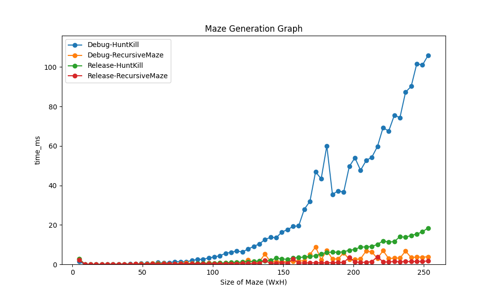
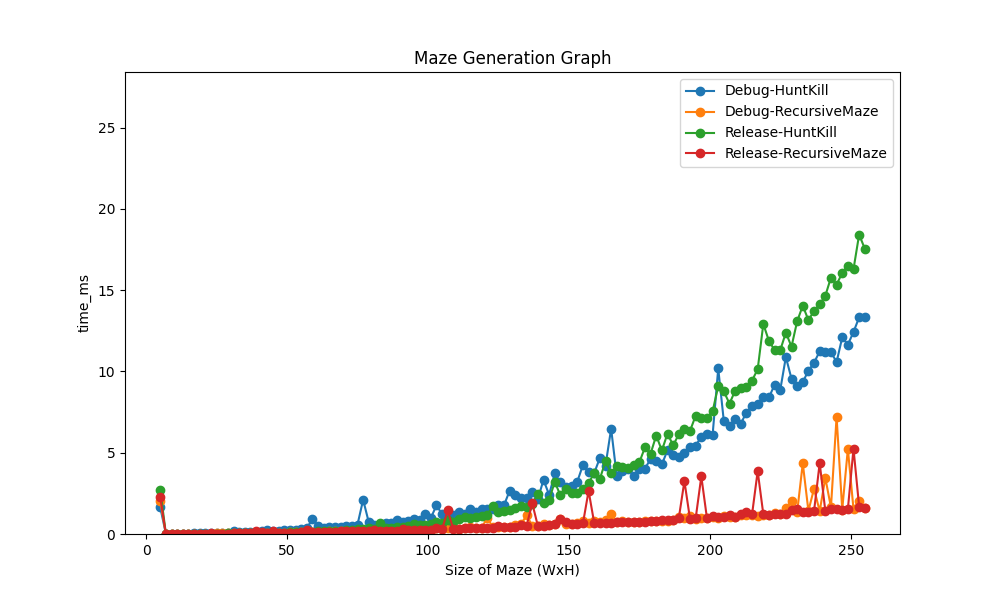
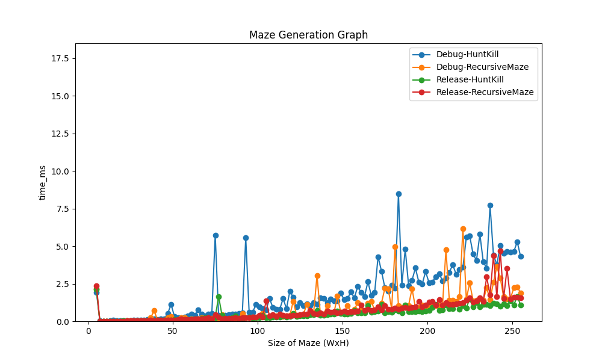
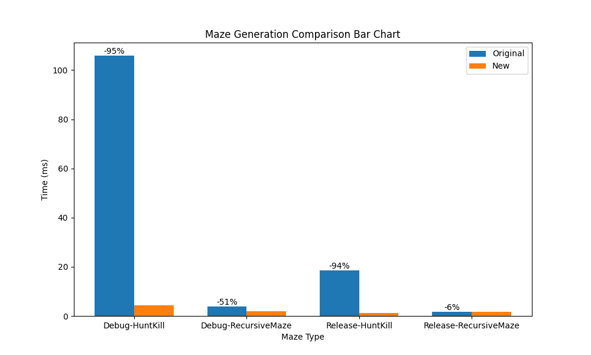

# Performance Report

### Methology

- This was testing on my desktop, however I had initially used the computers over vmware, but they were much slower for testing.
- The Benchmarking program will measure the time it takes for the creation of the maze to perform using the TimeIt and WriteToFile, however I added an extra WriteToCSV as the log contains more information about the process being ran, CSV was also easier to integrate right away with testing the graph.
- Python, along with matplotlib was used to plot the information on the graph since I found it easier, the script is in the BenchMarking/graphs/plot.py
- Chosen target of 253x253 mazes since it is small enough to test very fast, whilst also being large enough to notice memory errors, also because the initial mazehuntkill could not go high without waiting a long time (10minutes near 500x500).

#### Specfications of Hardware
- CPU
  - Intel i7 9700k @ 5ghz 1.27v
- GPU (although doesn't matter since this is not utilizing it)
  - Nvidia RTX 2070 Super 1935mhz 918mv
- RAM
  - 16GB DDR4 3200mhz

#### Setup
This is just how I tested it, we did not need to setup everything like this as per instructions.
1. Run the benchmark.cs in BenchMarking namespace under Debug to see results.
2. Click file in console, or navigate to file.
3. Copy everythng over to a new Excel spreadsheet
4. Add the following header as the first row (in excel): `MazeType	Time (ms)	Width	Height`
5. Replace plot.py file path with yours and run plot.py after installing dependencies.

#### Fixes 
- Fixed rendering of maze generation in MazeGame, now uses scaling to render in pixels to fill the screen.
- Allowed unrestricted sizes for the maze in MazeGame.

### Sources of Improvement
I have looked at the merge request left for Assignment4 before debuting the assignment. Noting some of the changes, mainly how the hunt and kill algorithm was set up. This would be the first step I'll take to improve it. As for MazeRecursion, I've noticed that it varied running it many times and I could not reduce its performance any further, however the debug had runs that would cut sometimes 0-75%, although I have no idea why.

Some of the main improvements for hunt and kill were:
- Walking:
  - Walking should not be called recursively as it will call itself repeatively.
- Unvisited cells:
  - Tracking unvisited cells vs visited cells 
- Don't keep walking instead of searching/hunting for values nearest:
  - Hunting for nearest values will drastically lower performance
- Walk using current, rather than the next:
  - Next will just cause a problem since we are skipping the nearest one.
- Repetition in code:
  - We can remove redundant calls and operations, there only needs to be a single walk function that can be used by the algorithm and then hunting can be simplified as a search until all nodes are visited.
- Lower reliance on randomness:
  - We can treat avoid some randomness when hunting as we want to be direct when hunting for an available node.
- Remove unnecessary calls:
  - Stack overflow will happen at 241x241 mazes in MazeHuntKill
  - This is due to calls storing previous values in the hunt or walking, however garbage collection cannot invoke itself since the previous methods are looping through everything.

### Findings

Through my testing iterations, I've found solutions for many of the issues that plagued the inital MazeHuntKill algorithm. I've discovered that my solution prior for the hunt and kill was not fast, nor very efficient with resources and had many problems trying to run through larger mazes, although it could. It would be much slower than the MazeRecursion.

#### Before Changes

I noticed the high progressive times of larger mazes exponentially increase, the more you increase the size of the maze. This means the operations undertaken in the original mazehuntkill were perfoming n operations that were stacking constantly as we added in more computations for it to do. 

When we look at the RecursiveMazes for testing, we notice that its always consistently under 10ms, whereas the hunt and kill is well over 100 on the debug. This is alarming considering just how long it takes for the hunt and kill to generate these initial mazes.

#### After Changes

I noticed that the complexity was due to how the algorithm was structured. As discussed in [Sources of Improvement](#sources-of-improvement), I noticed many of the issues were unnoticeable at smaller sizes for the maze, however it would become noticeable drastically as the size of the maze increases. After implementing these solutions, the graph became much more acceptable for its time complexity. 

As for why Maze Recursion doesn't have any issues with time complexity, I believe that is in part due to it being a recursive algorithm that is well optimized, thus having better yields on the performance and not needing any improvements.

Now, this is when I just needed to implement a small solution to remove the randomness from the mazehuntkill when its hunting, as I believed that to be a final source of degradation in performance.

#### Completion

This was in line with the recursion generation, and as the time complexity is still present with maze hunt kill, it would take a longer time to achieve the same performance degradation as seen in the initial findings. However, it appears that the results drew closer inline with those of the recursive generation., with the release perfectly in line with that trajectory. 

#### Final Results

This outlines the performance uplift seen in the application since the original testing. I believe the RecursiveMaze generation could've eased up on memory being freed up by the hunt and kill, which is why we see a decline in the Debug, but less so in the release. Although it was quite inconsistent, sometimes nearing 75% on the debug.

However, the biggest gains in performance were seen with the original hunt and kill against the new one. The new one has 95% of the time improved. Meaning for 5% of the time, the maze can be generated much more efficiently. These findings carried over to the release as well with a nearly 94% boost in performance. So this exponential time was removed from its O complexity, leading to a O(n) of running time complexity. Whereas for the maze recursion generation, it achieved a near O(n) throughout. The noise was chosen to be ignored since the garbage collection was also acting throughout this time and that starting point of 0 leading to a consistent ~2.5ms means it is probably present regardless of any changes.